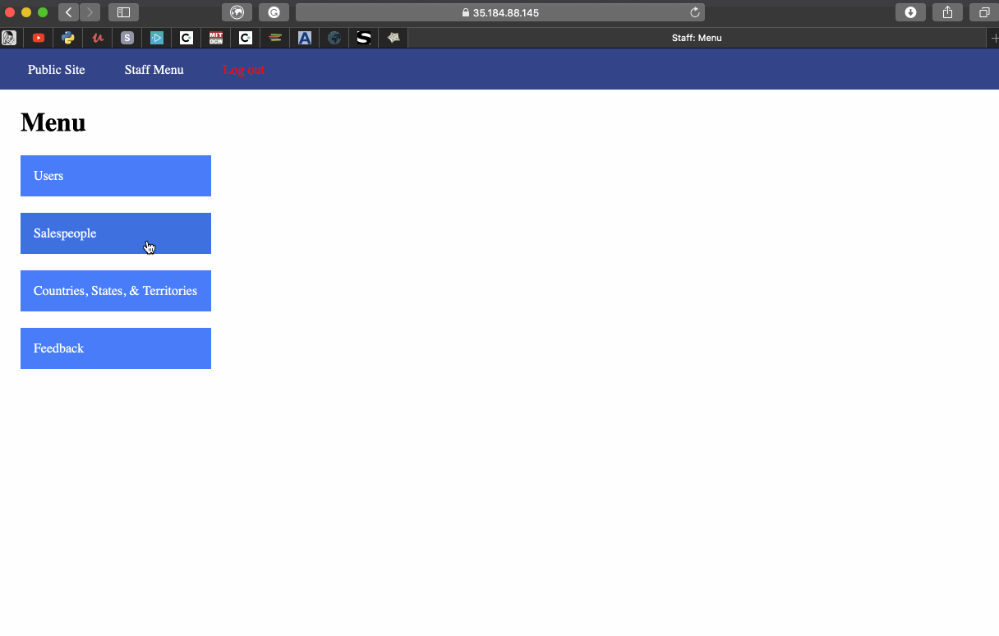
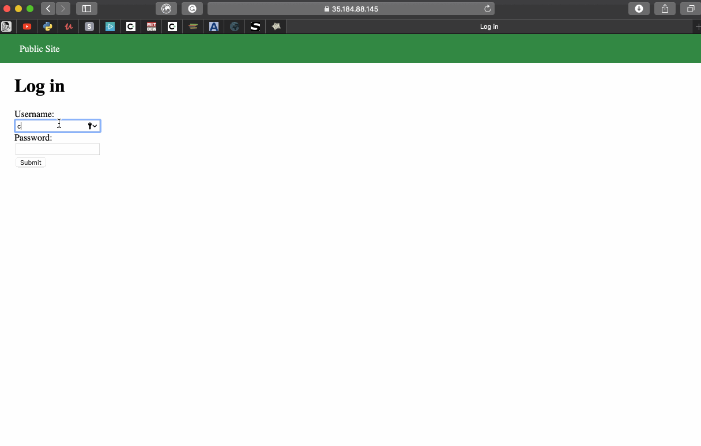

# Project 8 - Pentesting Live Targets

Time spent: **8** hours spent in total

> Objective: Identify vulnerabilities in three different versions of the Globitek website: blue, green, and red.

The six possible exploits are:
* Username Enumeration
* Insecure Direct Object Reference (IDOR)
* SQL Injection (SQLi)
* Cross-Site Scripting (XSS)
* Cross-Site Request Forgery (CSRF)
* Session Hijacking/Fixation

Each version of the site has been given two of the six vulnerabilities. (In other words, all six of the exploits should be assignable to one of the sites.)

## Blue

Vulnerability #1: Session Hijacking/Fixation:  

Since the session ID is not regenerated for this website, even when the user agent string changes, it is vulnerable to session hijacking. In the walkthrough, I showed how I can set the session ID in one browser (Google Chrome) to the one generated from logging in to the website using another browser (Safari). The attacker in the Google Chrome browser and is able to gain access to the staff area, example Saleperson as shown below.

GIF Walkthrough: 

Vulnerability #2: SQL Injection:

Under the salesperson information page, the user can perform an attack by adding a SQL injection to the end of the URL. As shown in the walkthrough, when adding ``` ' OR SLEEP(5)=0--' ``` to the end of the URL, the website shows a different staff member's profile, indicating that it responded to the SQL that was added. The mistake the developer made was not sanitizing the URL input.

GIF Walkthrough: 

## Green

Vulnerability #1: User Enumeration:

This vulnerability is on the Login page for the green website. The mistake the developer made was assigning a different class to failed login attempt message for valid usernames and invalid usernames. As shown in the walkthrough, attempting to login with the invalid username 'chrystal_mingo' results in a 'Log in was unsuccessful' message that is bolded, under the class 'failed'. On the other hand, attempting to login with the valid username 'pperson' with the incorrect password results in the same message unbolded, under the class 'failure'. An attacker can use this vulnerability to enumerate through usernames to figure out which are valid.

GIF Walkthrough: 

Vulnerability #2: Cross Site Scripting: In the contact tab, you can add a script when submitting a comment to the user. This allows the attacker to be spamm the users with pop ups.

#####ADD GIF HERE


## Red

Vulnerability #1: Insecure Direct Object Reference (IDOR):
* The ID of a person can be seen in the URL and can be changed to access the files of vissible and non vissible information.

#####ADD GIF HERE

Vulnerability #2: Cross-Site Request Forgery (CSRF): 
* When using an html file ("coolbeans.html" in this github)  you can change the information of a person based on a specific web address. The attacker just needs to convince the user to open the file.

#####ADD GIF HERE

## Bonus: 
Green- XSS: 
* You can use the same technique as before to redirect the user to a different page. In this case i redirected the user to youtube, but it can be used to redirect the user to a malicious. 


#####ADD GIF HERE


## Notes

Describe any challenges encountered while doing the work
